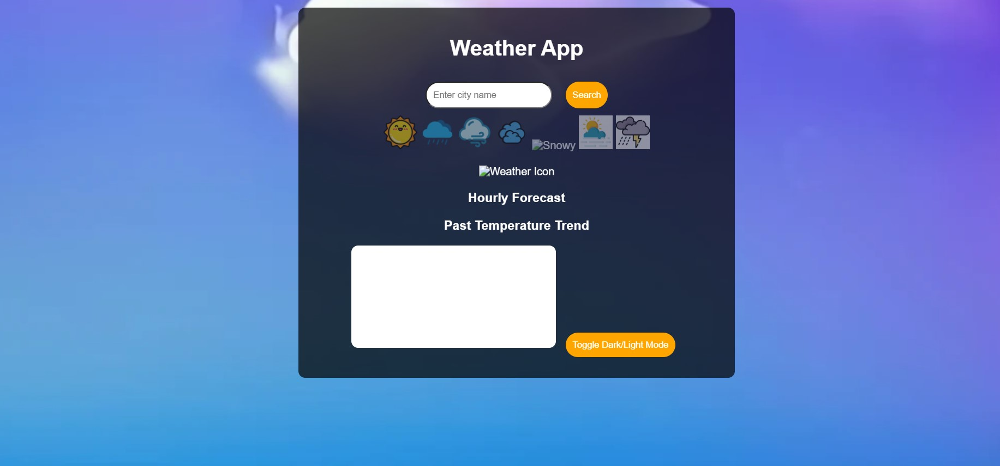

# 🌤️ Weather_App

## 📌 Overview
The **Weather App** is a web-based application that allows users to check real-time weather conditions for any city. It provides essential weather details such as temperature, humidity, wind speed, and an hourly forecast. Additionally, the app features dynamic background changes and weather-specific icons based on the current weather conditions.

## 🎯 Features
✔️ **Search for any city** to get live weather updates  
✔️ **Dynamic background changes** based on weather conditions (Rainy, Sunny, Cloudy, etc.)  
✔️ **Weather condition icons** (Sunny, Rainy, Windy, Cloudy, Snow, Haze, Thunderstorm)  
✔️ **Hourly weather forecast graph** for better insights  
✔️ **Dark/Light Mode Toggle** for better visibility  
✔️ **Responsive Design** for both desktop and mobile  

## 🖼️ Output
Here are some previews of the app:

### 🌍 Main Interface  

### 📊 Hourly Weather Report  

### 🌦️ Dynamic Background Change  

## 🛠️ Technologies Used
- **HTML, CSS, JavaScript** for frontend development  
- **OpenWeatherMap API** for real-time weather data  
- **Chart.js** for hourly weather visualization  

